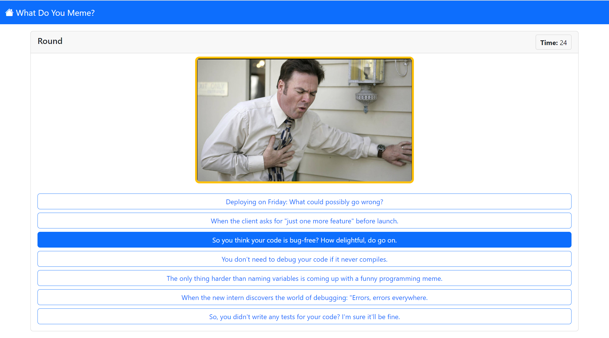
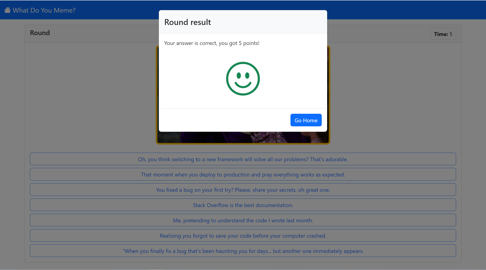

# Exam 1: "Gioco dei meme"
## Student: s323182 GUMINA MATTIA 

## React Client Application Routes

- Route `/`: home page
- Route `/login`: page with login form, to authenticate
- Route `/account`: page with account info (name, username and game history)
- Route `/game`: page for playing, where there is the quiz
- Route `/game/summary`: page for summary of a game just played

## API Server

- POST `/api/sessions`
  - description: API for login
  - request body content:
  `{ username: "luigi", password: "password"}`
  - response body content: `{id: 1, username: "luigi", name: "Luigi"}`
  - possible errors: `401 (Not authorized)`, `500 (Internal Server Error)`
- GET `/api/sessions/current`
  - description: API for getting information about the current logged user
  - request parameters: _None_
  - response body content: `{id: 1, username: "luigi", name: "Luigi"}`
  - possible errors: `401 (Not authenticated)`, `500 (Internal Server Error)`
- DELETE `/api/sessions/current`
  - description: API for logout
  - request parameters: _None_
  - response body content: _None_
- GET `/api/startGame`
  - description: API for start a game, to obtain the memes
  - request parameters: _None_
  - response body content: 
    - if user is not logged, return only 1 meme object: `{id: 1, path: "images/meme_1.png"}`
    - if user is logged, return 3 meme objects: `[
      {
        id: 1,
        path: "images/meme_1.png"
      },
      ...
    ]`
  - possible errors: `500 (Internal Server Error)`
- GET `/api/startRound/:memeId`
  - description: API for starting a round of a game, to obtain the captions options for one specific meme
  - request parameters: _memeId_ (the id of the meme for this round)
  - response body content: `[{id: 1, text: "caption of a meme"}, ...]`
  - possible errors: `404 (Not Found)`, `422 (Unprocessable Entity)`, `500 (Internal Server Error)`
- POST `/api/endRound/:memeId`
  - description: API for finishing a round, that request the option selected and check if it correct or no
  - request parameters: _memeId_ (the id of the meme for this round)
  - request body content: `{captionsOptions: [1, 2, 3, 4, 5, 6, 7], captionSelected: 1}` (captionSelected can be `null`)
  - response body content: 
    - if option selected is correct: `{correct: true, correctOptions: []}`
    - if option selected is not correct `{correct: false, correctOptions: [1, 2]}`
  - possible errors: `404 (Not Found)`, `422 (Unprocessable Entity)`, `409 (Conflict)`, `500 (Internal Server Error)`
- POST `/api/games`
  - description: API for saving information about a game, require authentication (login)
  - request body content: `rounds: [{memeId: 1, score: 5}, {memeId: 2, score: 0}, {memeId: 3, score: 5}]`
  - response body content: `{gameId: 1}`
  - possible errors: `404 (Not Found)`, `422 (Unprocessable Entity)`, `500 (Internal Server Error)`
- GET `/api/games`
  - description: API for getting informations about all the games of the user, require authentication (login)
  - request parameters: _None_
  - response body content: `[{id: 1, user: 1, score: 10, date: "2020-06-01 10:00"}, ...]`
  - possible errors: `500 (Internal Server Error)`
- GET `/api/games/:gameId/rounds`
  - description: API for getting informations about the rounds of a specific game, require authentication (login)
  - request parameters: _gameId_ (the id of the game)
  - response body content: `[{gameId: 1, meme: {id: 1, path: "meme1path"}, score: 5}, {gameId: 1, meme: {id: 2, path: "meme2path"}, score: 0}, {gameId: 1, meme: {id: 3, path: "meme3path"}, score: 5}]`
  - possible errors: `404 (Not Found)`, `500 (Internal Server Error)`

## Database Tables

- Table `users` {
  - "**id**" INTEGER
  - "name" TEXT
  - "username" TEXT
  - "password" TEXT
  - "salt" TEXT
}
- Table `memes` {
  - "**id**" INTEGER
  - "path" TEXT
}
- Table `captions` {
  - "**id**" INTEGER
  - "text" TEXT
}
- Table `captions_association` {
  - "**memeId**" INTEGER (REFERENCES *memes*(*id*))
  - "**captionId**" INTEGER (REFERENCES *captions*(*id*))
}
- Table `games` {
  - "**id**" INTEGER
  - "userId" INTEGER (REFERENCES *users*(*id*))
  - "score" INTEGER
  - "date" TEXT
}
- Table `game_rounds` {
  - "**gameId**" INTEGER (REFERENCES *games*(*id*))
  - "**memeId**" INTEGER (REFERENCES *memes*(*id*))
  - "score" INTEGER
}

## Main React Components

- `HomePage` (in `HomePage.jsx`): the home page of the application, contains the title and the button to login, start a game and go to account page
- `AccountPage` (in `AccountPage.jsx`): page that contains the user information (name and username) and the list of games played by the user
- `RoundPage` (in `RoundPage.jsx`): page where the user see the image of the meme and the possible captions, and select one of those
- `GameSummary` (in `GameSummary.jsx`): component in which the correct rounds of the just played game are showed
- `GamesList` (in `GamesList.jsx`): component that contains a list of games, and for each game there is the possibility to expand it to see the rounds
- `GameComponent` (in `GameComponent.jsx`): component that contains the information of a game (date and score) and, if expanded, the rounds of that game with their meme (image) and relative score

## Screenshot

## Users Credentials

- username: `luigi` password: `password`
- username: `luca` password: `password`
